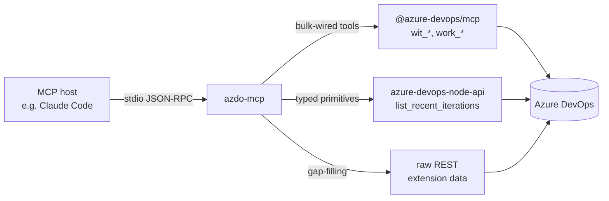

# AzDO MCP

A local **MCP (Model Context Protocol) server** that makes Azure DevOps operable from inside Claude Code (or any other MCP-aware host) — read tickets, draft work items, post comments, generate sprint reports — without opening `dev.azure.com` for plumbing work.

The split is deliberate: **skills are the UI, MCP is the bus.** A thin server exposes the primitives; compound workflows live as Markdown skill files that anyone can read, fork, and edit without recompiling anything.

## Why this exists

Azure DevOps lacks the agentic workflow tooling that GitHub and Linear users now expect. Microsoft's own MCP server stops at the primitive layer: it ships the building blocks, not the workflows. Their `CONTRIBUTING.md` explicitly declines to accept "complex tools that require extensive logic".

**AzDO MCP** fills the gap:

- **Primitives** live in TypeScript on the server side and stay minimal — fetch context, list iterations, read sprint goals.
- **Workflows** live as Markdown `SKILL.md` files on the host side. Adding a new workflow is a text edit, not a release cycle.

The result is one MCP server, one PAT, one `.env`, and a workflow library you can extend in place.

## How it talks to Azure DevOps

The server reaches Azure DevOps through three layers, picking the lightest one that does the job:



| Layer | Used for | Example |
|---|---|---|
| Microsoft's `@azure-devops/mcp` (bulk-wired) | All standard work-item and iteration operations Microsoft already covers — query, batch fetch, create, update, comment, link. | `wit_query_by_wiql`, `wit_add_work_item_comment`, `work_list_team_iterations` |
| `azure-devops-node-api` (typed SDK) | Author-written primitives that fill gaps the upstream tool palette does not cover. | `list_recent_iterations` |
| Raw REST | Endpoints with no typed SDK at all — for instance, marketplace-extension data. | `get_sprint_goal` (reads a public sprint-goal marketplace extension where installed) |

All three layers share one PAT and one tool namespace, so the host sees a single palette regardless of origin.

## Skills

Four ready-to-use Markdown skills under `skills/azdo-*/`:

- **`azdo-fetch-tickets`** — fetch one or many work items by ID, iteration, or compound criteria; render as Markdown.
- **`azdo-create-ticket`** — draft and create a new work item, optionally linked to existing ones; previews the payload and waits for explicit approval before writing.
- **`azdo-add-comment`** — post a Markdown comment to a work item; renders the body as it will appear, then waits for the go-ahead.
- **`azdo-sprint-report`** — generate a stakeholder-facing narrative covering the previous sprint and the current sprint goals; optionally publishes the result as a comment on a target work item.

Every write-path skill follows the same pattern: gather inputs, render a preview, wait for an explicit verb ("post", "create", "approved"), then mutate. Silence is never approval.

## Requirements

- **Node.js 24 LTS** or later.
- **pnpm 10.33** or later (pinned via `packageManager` in `package.json`).
- An MCP-aware host. Claude Code is the reference target; other hosts (VS Code, Cursor, Claude Desktop) may work but are not regression-tested.
- An **Azure DevOps Personal Access Token** with these scopes:
  - **Work Items** — Read & Write
  - **Project & Team** — Read
  - **Extension Data** — Read (only needed for `get_sprint_goal`)

## Quick start

```bash
pnpm install
cp .env.example .env
# fill in AZDO_ORG, AZDO_PAT, and the optional defaults
```

There is no build step — the server runs through `tsx` directly.

If you use Claude Code, the project-scoped `.mcp.json` at the repo root is auto-discovered when you open the repo as a workspace; the server spawns on demand the first time a `mcp__azdo__*` tool is invoked.

To test the server outside any host, run the bundled MCP Inspector:

```bash
pnpm inspect
```

This opens a local web UI where you can browse and invoke every registered tool against your real Azure DevOps organisation.

## Use as a plugin in another project

This repo doubles as a Claude Code plugin. The plugin loads its own `node_modules` and reads credentials from its own `.env`, so consuming projects never need to touch dependencies or secrets.

### One-time setup (in this repo)

```bash
pnpm install
cp .env.example .env
# fill in AZDO_ORG, AZDO_PAT, and the optional defaults
```

The plugin's MCP server boots with `node --env-file-if-exists=${CLAUDE_PLUGIN_ROOT}/.env`, so this `.env` is the single source of credentials for every consumer.

### Enable the plugin in a target project

Add two top-level keys to the consuming project's `.claude/settings.local.json` (gitignored, personal) or `.claude/settings.json` (committed, team-shared):

```json
{
  "extraKnownMarketplaces": {
    "azdo-mcp": {
      "source": {
        "source": "directory",
        "path": "/absolute/path/to/azdo-mcp"
      }
    }
  },
  "enabledPlugins": {
    "azdo@azdo-mcp": true
  }
}
```

Replace `/absolute/path/to/azdo-mcp` with the path to your clone. For machine-wide enablement across every project, put the same two keys in `~/.claude/settings.json` instead.

Open the target project in Claude Code: the plugin loads on session start, surfacing the four skills and the `azdo` MCP server. At first run Claude Code prompts for the `AZDO_*` values; skip the dialog and the server falls back to a `.env` in the plugin source directory.

## Configuration

All configuration lives in a single `.env` file at the repo root:

| Variable | Required | Purpose |
|---|---|---|
| `AZDO_ORG` | yes | Azure DevOps organisation name (the slug, not the URL). |
| `AZDO_PAT` | yes | Personal Access Token with the scopes listed above. |
| `AZDO_DEFAULT_PROJECT` | no | Default project for skills that need one when the user does not name it. |
| `AZDO_DEFAULT_TEAM` | no | Default team for sprint and iteration queries. |
| `AZDO_USER_EMAIL` | no | Identity used by skills to attribute work to the current user. |

Real secrets stay on your machine. The server reads `.env` via Node's native `--env-file` flag — no `dotenv` dependency, no host-config secret material.

## Licence

To be decided before the first tagged release. Until then, the repository is published for inspection only.

### _Built with BMAD._
